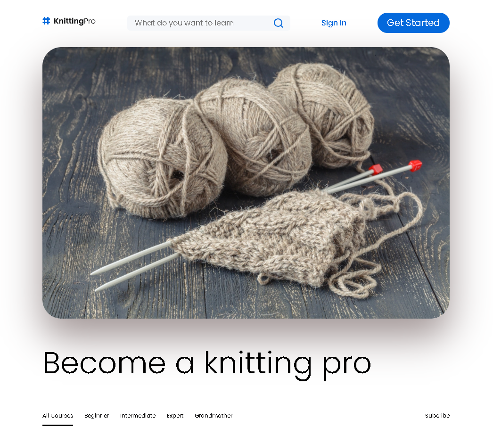

## Table of contents

- [Overview](#overview)
  - [The challenge](#the-challenge)
  - [Screenshot](#screenshot)
  - [Links](#links)
- [My process](#my-process)
  - [Built with](#built-with)
  - [What I learned](#what-i-learned)
  - [Continued development](#continued-development)
  - [Useful resources](#useful-resources)
- [Author](#author)

## Overview

Advanced CSS challenge building a responsive website using Flexbox and CSS Grid and other CSS techniques.

### The challenge

Recreating this responsive website as close as possible from a Figma design. This should be achieved by using CSS variables, utility classes, flat selectors and layouts such as Flexbox and CSS Grid. 
While building the site one of the aims was to be aware of stacking and formatting contexts in CSS.

### Screenshot

### Links

- Live Site URL: [Add live site URL here](https://your-live-site-url.com)

## My process

-Built from a design in Figma
- Most sections on the site using Flexbox as main layout for responsiveness
- The courses section was a good case for using CSS Grid
- Used utility classes for spacing, colors and buttons.
- I first coded the HTML from the desktop design version.
- For CSS styling and responsiveness the Mobile-first approach was used.

### Built with

- Semantic HTML5 markup
- CSS resets
- CSS custom properties
- Use of utility classes
- Use of flat selectors
- Flexbox
- CSS Grid
- Mobile-first workflow

### What I learned

I got to practice with CSS variables, utility classes and layouts.

### Continued development

I will continue to improve with my layout skills. My aim is to get more comfortable with CSS grid!

### Useful resources

This project was one of the challenged I had to complete from Kevin Powell’s CSS Demystified course.

## Author

- Website - [Annie Indreiten](https://www.your-site.com)
- Github – https://github.com/AnnieCat73
- LinkedIn - https://www.linkedin.com/in/annie-indreiten777/

